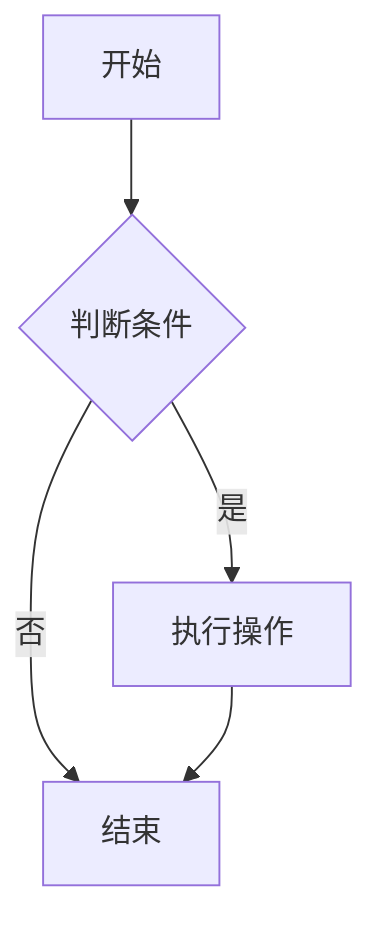

# Mermaid Better

> 🎨 在线 Mermaid 图表编辑器 - 实时预览、云端存储、协作分享

一个功能完整的 Mermaid 图表在线编辑器，支持实时预览、云端保存和多格式导出。

[](https://nextjs.org/)
[](https://www.typescriptlang.org/)
[](https://neon.tech/)
[](https://mermaid.js.org/)

## ✨ 功能特性

### 核心功能
- 🎨 **实时编辑器** - Monaco Editor 支持，语法高亮和自动补全
- 👁️ **实时预览** - 即时渲染 Mermaid 图表
- 💾 **云端保存** - 自动保存到 Neon PostgreSQL 数据库
- 📑 **模板库** - 内置多种图表模板（流程图、序列图、类图等）
- 🔗 **分享功能** - 生成分享链接，支持公开/私密模式
- 📊 **Dashboard** - 管理所有图表，支持搜索和筛选

### 增强功能
- ⌨️ **键盘快捷键** - 保存、导出、新建等快捷操作（Ctrl+S、Ctrl+E、Ctrl+N）
- 📤 **多格式导出** - 支持 PNG、SVG、PDF 格式
- 🔍 **搜索过滤** - 快速查找图表
- ↩️ **撤销/重做** - 编辑历史管理（Ctrl+Z / Ctrl+Y）

### 用户认证
- 🔐 **Neon Auth** - 安全的用户认证系统
- 👤 **用户管理** - 注册、登录、退出登录

### 支持的图表类型
- 流程图 (Flowcharts)
- 序列图 (Sequence Diagrams)
- 类图 (Class Diagrams)
- ER 图 (ER Diagrams)
- 甘特图 (Gantt Charts)
- 饼图 (Pie Charts)
- 用户旅程图 (User Journey)
- 思维导图 (Mind Maps)
- Git 图 (Git Graphs)

## 🏗️ 技术栈

| 分类 | 技术 |
|------|------|
| **框架** | Next.js 15.5.10 (App Router) |
| **语言** | TypeScript 5.5 |
| **数据库** | Neon PostgreSQL (Serverless) |
| **ORM** | Drizzle ORM |
| **认证** | Neon Auth (Better Auth) |
| **编辑器** | Monaco Editor |
| **图表** | Mermaid.js 11 |
| **样式** | Tailwind CSS |
| **部署** | Cloudflare Workers / Pages |

## 📁 项目结构

```
mermaid-better/
├── src/
│   ├── app/              # Next.js App Router 页面
│   │   ├── api/          # API 路由
│   │   ├── dashboard/    # 仪表板页面
│   │   ├── editor/       # 编辑器页面
│   │   ├── login/        # 登录页面
│   │   ├── register/     # 注册页面
│   │   ├── share/        # 分享页面
│   │   └── templates/    # 模板页面
│   ├── components/       # React 组件
│   ├── lib/             # 工具库和配置
│   │   └── neon/        # Neon 数据库配置和 schema
│   └── utils/           # 工具函数
├── scripts/             # 数据库脚本
│   ├── check-templates.ts
│   └── seed-templates.ts
├── tests/               # 测试文件
├── docs/                # 项目文档
│   └── DEPLOYMENT.md    # 部署指南
├── drizzle/             # Drizzle 迁移文件
├── .env                 # 环境变量（本地）
├── .dev.vars            # Wrangler 环境变量（本地）
├── drizzle.config.ts    # Drizzle 配置
├── next.config.js       # Next.js 配置
├── open-next.config.ts  # OpenNext Cloudflare 配置
├── wrangler.jsonc       # Cloudflare Workers 配置
└── package.json         # 项目依赖
```

## 🚀 快速开始

### 前置要求

- Node.js 22+
- pnpm 8+
- Neon PostgreSQL 数据库账号
- Cloudflare 账号（部署用）

### 安装依赖

```bash
pnpm install
```

### 配置环境变量

复制 `.env.example` 到 `.env` 并填入你的配置：

```bash
cp .env.example .env
```

编辑 `.env` 文件：

```env
# Neon Auth URL
NEXT_PUBLIC_NEON_AUTH_URL=your_neon_auth_url

# Neon Data API URL
NEXT_PUBLIC_NEON_DATA_API_URL=your_neon_data_api_url

# Database Connection String (with pooler)
DATABASE_URL=postgresql://...@...-pooler.neon.tech/...

# App URL
NEXT_PUBLIC_APP_URL=http://localhost:3000
```

### 初始化数据库

```bash
# 生成 schema
pnpm run db:generate

# 推送到数据库
pnpm run db:push

# (可选) 填充模板数据
pnpm tsx scripts/seed-templates.ts
```

### 启动开发服务器

```bash
pnpm dev
```

访问 http://localhost:3000

## 📖 使用指南

### 创建第一个图表

1. **注册账号** - 在首页点击注册
2. **新建图表** - Dashboard 中点击 "新建图表"
3. **编写代码** - 左侧编辑器输入 Mermaid 代码
4. **实时预览** - 右侧实时显示渲染结果
5. **保存图表** - 填写标题并保存

### Mermaid 代码示例



### 导出图表

在编辑器中可以：
- **导出为 PNG** - 适合文档和演示
- **导出为 SVG** - 可缩放矢量图
- **导出为 PDF** - 适合打印
- **复制代码** - 用于 Markdown 文件

## 📦 构建和部署

### 方式 1: Cloudflare Workers (推荐)

```bash
# 1. 构建 Workers 版本
pnpm run build:worker

# 2. 配置 secrets
npx wrangler secret put DATABASE_URL
npx wrangler secret put NEXT_PUBLIC_APP_URL

# 3. 部署
pnpm run deploy:worker
```

详细步骤见 [docs/DEPLOYMENT.md](docs/DEPLOYMENT.md)

### 方式 2: Cloudflare Pages

在 Cloudflare Pages Dashboard 配置：

```
Framework preset: Next.js
Build command: pnpm run build
Build output directory: .next
Root directory: /
```

添加环境变量后部署。详见 [docs/DEPLOYMENT.md](docs/DEPLOYMENT.md)

### 标准 Next.js 构建

```bash
pnpm run build
pnpm start
```

## 🧪 测试

```bash
# 运行所有 UI 测试
node tests/test-all-ui.js

# 测试特定功能
node tests/test-app.js
node tests/test-templates.js
node tests/test-sharing.js
node tests/test-phase7-features.js
```

## 📝 可用命令

```bash
# 开发
pnpm dev              # 启动开发服务器
pnpm dev:worker       # 启动 Workers 开发服务器
pnpm preview:worker   # 预览 Workers 构建

# 构建
pnpm build            # 标准 Next.js 构建
pnpm build:worker     # Workers 构建

# 部署
pnpm deploy:worker    # 部署到 Cloudflare Workers

# 数据库
pnpm db:generate      # 生成 Drizzle schema
pnpm db:push          # 推送到数据库
pnpm db:migrate       # 运行迁移
pnpm db:studio        # 打开 Drizzle Studio

# 代码质量
pnpm lint             # 运行 ESLint
pnpm format           # 格式化代码 (Prettier)
pnpm format:check     # 检查格式
```

## ⌨️ 键盘快捷键

| 快捷键 | 功能 |
|--------|------|
| `Ctrl/Cmd + S` | 保存图表 |
| `Ctrl/Cmd + E` | 导出为 PNG |
| `Ctrl/Cmd + N` | 新建图表 |
| `Ctrl/Cmd + Z` | 撤销 |
| `Ctrl/Cmd + Y` | 重做 |
| `Ctrl/Cmd + Shift + Z` | 重做 (备用) |

## 🗺️ API 文档

### 图表 API

#### `GET /api/diagrams`
获取当前用户的所有图表

#### `POST /api/diagrams`
创建新图表
```json
{
  "title": "我的流程图",
  "content": "graph TD\nA-->B",
  "type": "flowchart",
  "description": "可选描述"
}
```

#### `GET /api/diagrams/:id`
获取指定图表

#### `PATCH /api/diagrams/:id`
更新图表
```json
{
  "title": "更新的标题",
  "content": "graph TD\nA-->B-->C"
}
```

#### `DELETE /api/diagrams/:id`
删除图表

#### `POST /api/diagrams/:id/share`
生成分享链接
```json
{
  "isPublic": true
}
```

### 模板 API

#### `GET /api/templates`
获取所有公开模板

#### `GET /api/templates/:id`
获取指定模板

## 📚 文档

- [部署指南](docs/DEPLOYMENT.md) - Cloudflare Workers 和 Pages 部署

## 🤝 贡献

欢迎提交 Issue 和 Pull Request！

1. Fork 本仓库
2. 创建功能分支 (`git checkout -b feature/AmazingFeature`)
3. 提交更改 (`git commit -m 'Add some AmazingFeature'`)
4. 推送到分支 (`git push origin feature/AmazingFeature`)
5. 创建 Pull Request

## 📄 许可证

MIT License

## 🙏 致谢

- [Next.js](https://nextjs.org/) - React 框架
- [Mermaid.js](https://mermaid.js.org/) - 强大的图表库
- [Neon](https://neon.tech/) - Serverless PostgreSQL
- [Cloudflare](https://www.cloudflare.com/) - 边缘计算平台
- [Monaco Editor](https://microsoft.github.io/monaco-editor/) - VS Code 编辑器
- [Drizzle ORM](https://orm.drizzle.team/) - TypeScript ORM

---

**用 ❤️ 构建 | Powered by Next.js, Mermaid.js, and Neon**
